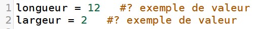
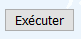
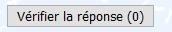

# Instructions et types de base en Python

Le cours de première  : [cours.pdf](Cours.pdf)

## Travail en autonomie

Un travail en autonomie pour acquérir des automatismes est possible (merci à Jean Diraison - académie de Rennes). Pour cela, il suffit de cliquer sur le lien. Chaque page propose un et un seul exercice. 

- il est possible de modifier les valeurs données en **exemple** 
- en cliquant sur **executer**  le calcul demandé est évalué et s'affiche à droite de la fenêtre
- en cliquant sur **vérifier**  votre réponse est automatiquement corrigée. Au bout de 10 erreurs, une solution vous est proposée.

## Niveau 1 :
1. [aire d'un rectangle](https://josedelamare.github.io/supersite/Premiere/02-introduction_python/aire-1.html)
2. [aire d'un carre](https://josedelamare.github.io/supersite/Premiere/02-introduction_python/aire-2.html)
3. [périmètre d'un rectangle](https://josedelamare.github.io/supersite/Premiere/02-introduction_python/perimetre-1.html)
4. [périmètre d'un carré](https://josedelamare.github.io/supersite/Premiere/02-introduction_python/perimetre-2.html)
5. [calcul simple](https://josedelamare.github.io/supersite/Premiere/02-introduction_python/operation-1.html)

## Niveau 2 :
1. [calcul de fraction](https://josedelamare.github.io/supersite/Premiere/02-introduction_python/operation-2.html)
2. [inverse d'un polynôme de degré 1](https://josedelamare.github.io/supersite/Premiere/02-introduction_python/operation-3.html)
3. [division de deux polynômes](https://josedelamare.github.io/supersite/Premiere/02-introduction_python/operation-4.html)
4. [calcul d'un prix TTC](https://josedelamare.github.io/supersite/Premiere/02-introduction_python/prix-ttc.html)

## Niveau 3 :
1. [division emboîtées de polynômes](https://josedelamare.github.io/supersite/Premiere/02-introduction_python/operation-5.html)
2. [volume et surface d'un cube](https://josedelamare.github.io/supersite/Premiere/02-introduction_python/cube.html)
3. [volume et surface d'un parallélepipède](https://josedelamare.github.io/supersite/Premiere/02-introduction_python/parallepipede.html)
4. [calcul d'un prix HT](https://josedelamare.github.io/supersite/Premiere/02-introduction_python/prix-ht.html)