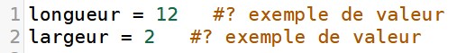
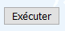

# Instructions conditionnelles en Python

Le cours de première  : [cours.pdf](Cours.pdf)

## Travail en autonomie

Un travail en autonomie pour acquérir des automatismes est possible (merci à Jean Diraison - académie de Rennes). Pour cela, il suffit de cliquer sur le lien. Chaque page propose un et un seul exercice. 

- il est possible de modifier les valeurs données en **exemple** 
- en cliquant sur **executer**  le calcul demandé est évalué et s'affiche à droite de la fenêtre
- en cliquant sur **vérifier**  votre réponse est automatiquement corrigée. Au bout de 10 erreurs, une solution vous est proposée.

## Niveau 1 :
1. [racine carré version 1](https://josedelamare.github.io/supersite/Premiere/04-instructions_conditionnelles/n1_racine1.html)
2. [racine carré version 2](https://josedelamare.github.io/supersite/Premiere/04-instructions_conditionnelles/n1-racine2.html)
3. [test de parité](https://josedelamare.github.io/supersite/Premiere/04-instructions_conditionnelles/n1_parite.html)
4. [obtention d'un diplôme version 1](https://josedelamare.github.io/supersite/Premiere/04-instructions_conditionnelles/n1_moyenne1.html)
5. [obtention d'un diplôme version 2](https://josedelamare.github.io/supersite/Premiere/04-instructions_conditionnelles/n1_moyenne2.html)
6. [fonction définie par partie](https://josedelamare.github.io/supersite/Premiere/04-instructions_conditionnelles/n1_fonction1.html)

## Niveau 2 :
1. [réduction au labo photo](https://josedelamare.github.io/supersite/Premiere/04-instructions_conditionnelles/n2_photos.html)
2. [réduction au cinéma](https://josedelamare.github.io/supersite/Premiere/04-instructions_conditionnelles/n2_cinema.html)
3. [entrée au manège](https://josedelamare.github.io/supersite/Premiere/04-instructions_conditionnelles/n2_manege.html)
4. [pair et multiple de 3 ?](https://josedelamare.github.io/supersite/Premiere/04-instructions_conditionnelles/n2_multiple1.html)
5. [pair et multiple de 5 ?](https://josedelamare.github.io/supersite/Premiere/04-instructions_conditionnelles/n2_multiple2.html)

## Niveau 3 :
1. [réduction sur facture](https://josedelamare.github.io/supersite/Premiere/04-instructions_conditionnelles/n3_reduction.html)
2. [Ali Baba](https://josedelamare.github.io/supersite/Premiere/04-instructions_conditionnelles/n3_sesame.html)
3. [Fashion victim](https://josedelamare.github.io/supersite/Premiere/04-instructions_conditionnelles/n3_fashion.html)
4. [Survivre au naufrage du Titanic ?](https://josedelamare.github.io/supersite/Premiere/04-instructions_conditionnelles/n3_titanic.html)
