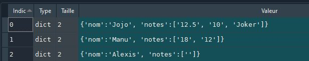

### Tirage au sort d'un ordre de passage à l'oral

Ce logiciel a été réalisé en Python. Il permet, à partir d'un fichier CSV, de générer une liste d'élèves susceptibles de passer à l'oral.

## 1. Principes généraux

### a. Contenu du fichier CSV
Le fichier CSV contient 2 colonnes : 
- première colonne : le nom
- deuxième colonne : les notes, chacune séparées par une virgule. 

nom;notes
Jojo;12.5,10,Joker
Manu;18,12
Alexis;

**Joker** signifie que l'élève n'a pas souhaité répondre lors de son précédent tirage. Il a pris un **Joker**.😊

### b. Utilisation du fichier CSV

La fonction *ouverture()* renvoie une liste de dictionnaires. Chaque dictionnaire contient 2 clés ('nom' et 'notes') :

- la valeur associée à la clé *nom* est le nom de l'élève
- la valeur associée à la clé *notes* est une liste contenant les différentes notes qu'il a déjà eu (ce sont des chaînes de caractères).

### c. Détermination d'un classement

Afin de permettre aux élèves faibles, mais aussi de "rattraper" une mauvais note, on établit un classement tenant compte **à la fois** du nombre de fois où on est interrogé, et **à la fois** de la moyenne déjà acquise.

Ainsi, un élève qui a une moyenne basse sera plus souvent interrogé qu'un élève qui a une moyenne haute.

## 2. Principes déterminant l'ordre de passage

- Un élève qui n'a jamais été interrogé est prioritaire.

- Un élève dont le nombre de passages à l'oral est inférieur de 2 unités au maximum du nombre de passage de l'élève qui est le plus passé est prioritaire. Par exemple, si l'élève qui est passé le plus souvent à l'oral est passé 5 fois, tous les élèves qui sont passés 2 fois et moins sont prioritaires.

   C'est le rôle de la constante *ECART_MAX_PASSAGE*.

- Chaque passage à l'oral permet de collecter 10 points. C'est le rôle de la constante *POINT_PASSAGE*.

- On effectue la moyenne de toutes les notes déjà obtenues (variable *moyenne_des_notes*).

- On détermine un score pour chaque élève par le calcul suivant :
  $$
  score = \dfrac{(coeff\_passage * nbre\ de \ passage) + (coeff\_notes * moyennes\ notes)}{coeff\_passage + coeff\_notes}
  $$
  
- Les élèves éligibles (5 au minimum) sont placés dans un tableau. On commence alors par l'élève qui a le score le plus faible.

### 3. Point important concernant les Jokers

- Un élève ne peut utiliser qu'un maximum de 3 jokers (c'est le rôle de la constante *MAX_JOKERS*)
- Un élève ne peut pas utiliser 2 Jokers consécutifs.